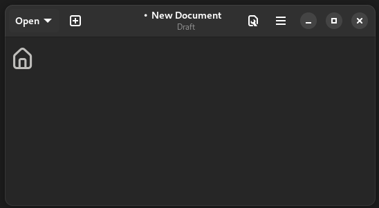

# UI5 Icon Explorer - VSCode extension

  

This extension allows you to explore SAPUI5 icons in a convenient way, similar to the SAPUI5 Icon Explorer. It provides the capability to filter icons and copy their values in different formats, including Unicode, the `sap-icon` protocol, and the symbol.

> Note: In the same way, I leave you a direct link to the [SAPUI5 icon explorer](https://sapui5.hana.ondemand.com/sdk/test-resources/sap/m/demokit/iconExplorer/webapp/index.html)

## Features
UI5 Icon explorer provides the following features:

### **SAP icon's list**

### **Icon filtering**

### **Copying icons**
Copy icons in different ways. By default, clicking on the icon copies the `sap-icon` value, useful for UI5 applications and similar.

Right-clicking on an icon displays a context menu with other copy options:

Each option copies the icon in the following way:
- **SAP URI**: Copies the icon into the SAP Icon Protocol. Ex: `sap-icon://home`
- **Symbol**: Copies the icon symbol directly. Ex:\
\
    > *Note: The 'SAP icons' font must be installed on the system for the symbol to be interpreted and displayed.*
- **Unicode**: Copies the Unicode value of the icon. Ex: `xe070`

### **Tags**
Each icon has tags with which you can search more freely. To see the tags, leave the mouse over the icon without clicking until the tooltip appears.

## Installation

To install the UI5 Icon Explorer extension, follow these steps:

1. Open Visual Studio Code.
2. Go to the Extensions view by clicking on the Extensions icon in the Activity Bar on the side of the window or by pressing `Ctrl+Shift+X`.
3. Search for "UI5 Icon Explorer".
4. Click the "Install" button.

## Release Notes

Please refer to the [CHANGELOG](./CHANGELOG.md) file for more information about the latest updates and changes.

## Support
If you encounter any issues or have any questions, please open an issue on the [GitHub repository](https://github.com/jorgesanux/ui5-icon-explorer-vscode/issues).

## Author
This extension was created by Jorge Sanabria. You can find more about my work on [GitHub](https://github.com/jorgesanux).

## Disclaimer
This extension is not affiliated with, endorsed by, or in any way associated with SAP or any of its trademarks. It is an independent tool created for the convenience of developers who work with SAPUI5/OpenUI5. All trademarks and registered trademarks are the property of their respective owners.

## Acknowledgements
This project uses icon mappings and tag relationships based on the SAP Icon Explorer from the [SAP/openui5](https://github.com/SAP/openui5) repository.

## License
This extension is licensed under the *Apache License Version 2.0*. See the [LICENSE](./LICENSE.md) file for more details. 